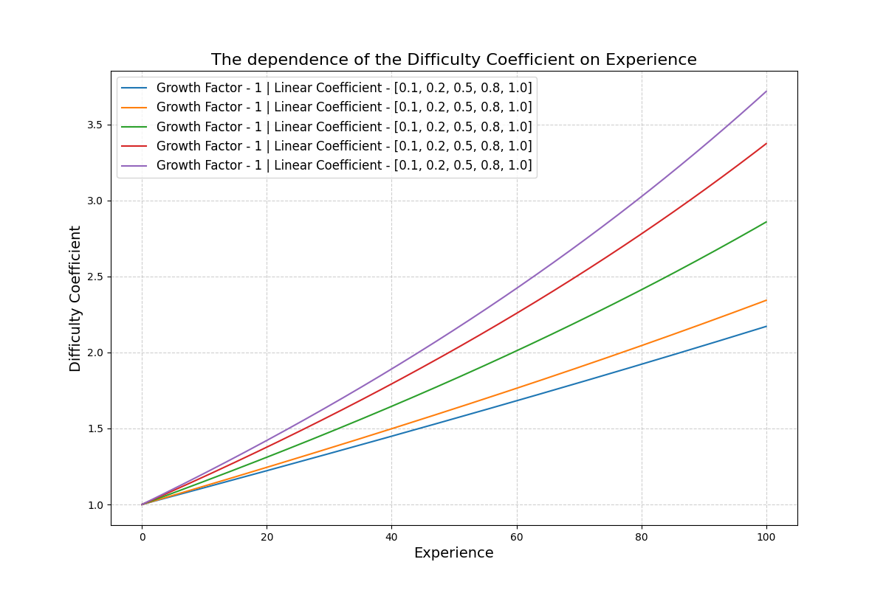
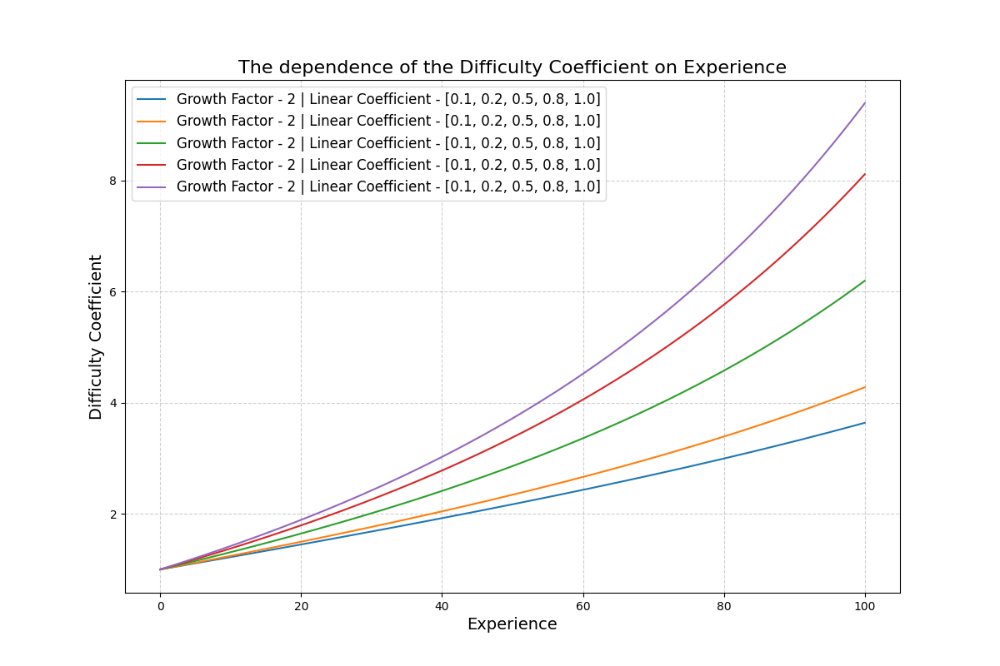
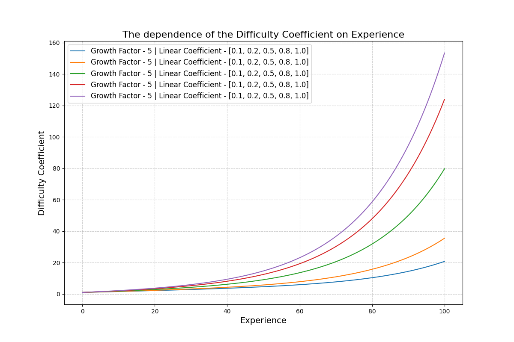
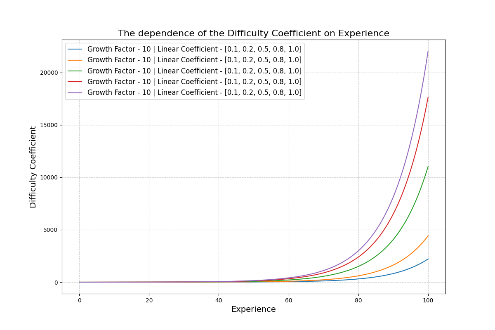

# Game Difficult Coefficient Calculator

A utility function for calculating the difficulty coefficient in games based on the player's progress and a customizable set of parameters. This function normalizes the current progress and computes a difficulty value using an adjustable growth factor, linear coefficient, and rounding precision.

## Installation

You can install this package via npm:

```bash
npm i game-difficult-coefficient-calculator
```

## Usage

### Import the function

You can import the function into your project as follows:

```ES modules
import { GameDifficultCoefCalculate }
   from 'game-difficult-coefficient-calculator';
```

### Syntax

```typescript
GameDifficultCoefCalculate(curValue, maxValue = 100, growthFactor = 1, linearCoeff = 0.5, roundTo = 2)
```

### Parameters

| Parameter     | Type     | Default | Description                                                                                                                                           |
|---------------|----------|---------|-------------------------------------------------------------------------------------------------------------------------------------------------------|
| `curValue`    | `number` |         | The current progress value (e.g., player's current experience or level).                                                                              |
| `maxValue`    | `number` | `100`   | The maximum possible value (e.g., maximum experience or level).                                                                                      |
| `growthFactor`| `number` | `1`    | A scaling factor that adjusts the exponential growth of the difficulty coefficient.                                                                   |
| `linearCoeff` | `number` | `0.5`   | A linear multiplier applied to the exponential term. Determines how much linear growth influences the difficulty curve.                               |
| `roundTo`     | `number` | `2`     | The number of decimal places to round the result to.                                                                                                 |

### Return Value

The function returns a `number` representing the calculated difficulty coefficient, rounded to the specified decimal precision.

### Example

```javascript
const { GameDifficultCoefCalculate } = require('game-difficult-coef-calculate');

// Example 1: Basic usage with default parameters
const difficulty1 = GameDifficultCoefCalculate(30);
console.log(difficulty1); // Output: A calculated difficulty coefficient

// Example 2: Custom parameters
const difficulty2 = GameDifficultCoefCalculate(75, 150, 5, 0.8, 3);
console.log(difficulty2); // Output: A calculated difficulty coefficient with 3 decimal precision
```

<div style="display: grid; grid-template-columns: repeat(2, 1fr); gap: 4px;">
  
  
  
  
</div>

### How It Works

1. **Normalize Progress**: The function normalizes the current progress value (`curValue`) relative to the maximum value (`maxValue`).
2. **Difficulty Calculation**: Combines:
   - A linear growth term scaled by `growthFactor`.
   - An exponential growth term adjusted by `linearCoeff`.
3. **Round to Precision**: The result is rounded to the specified number of decimal places using the `roundTo` parameter.

### Formula

The difficulty coefficient is calculated using the following formula:

```
difficultyCoefficient =
   1 + normalizedExperience * growthFactor
   + (Math.exp(growthFactor * normalizedExperience) - 1)
   * linearCoeff
```

Where:
- `normalizedExperience = curValue / maxValue`

## Why Use This?

This function is ideal for games that need a dynamic and scalable difficulty progression. It can adapt difficulty based on player experience, skill levels, or other metrics, allowing for more engaging and balanced gameplay.

## License

This project is licensed under the MIT License. See the [LICENSE](./LICENSE.txt) file for details.